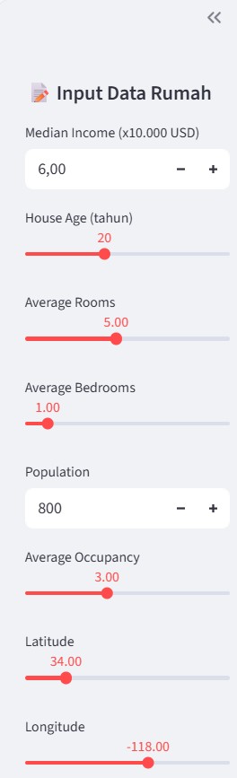
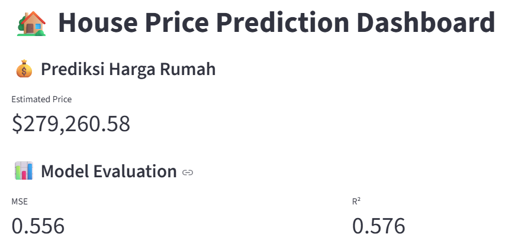
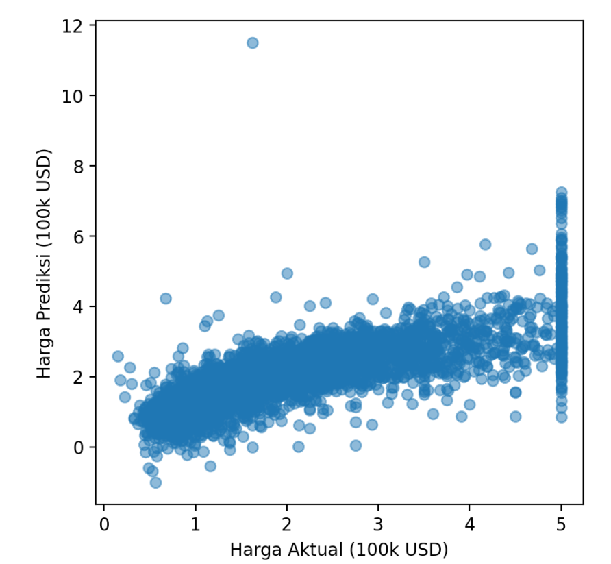

# 🏠 House Price Prediction Dashboard

Dashboard interaktif berbasis **Machine Learning** untuk memprediksi harga rumah menggunakan **California Housing Dataset**.  
Dibangun dengan **Python, Scikit-Learn, dan Streamlit**.  

---

## 🚀 Fitur Utama
- 📊 **Training Model Linear Regression** dengan evaluasi MSE & R²  
- 🖊️ **Input data rumah via sidebar** (pendapatan, usia rumah, kamar, populasi, dll.)  
- 💰 **Prediksi harga rumah real-time** dengan tampilan `st.metric` yang jelas  
- 🔎 **Visualisasi faktor utama** yang memengaruhi harga rumah  
- 🌍 **Perbandingan harga aktual vs prediksi per wilayah**  

---

## 📂 Struktur File
```
.
├── HousePredict.py   # Main Streamlit App
├── requirements.txt  # Daftar library Python
└── README.md         # Dokumentasi proyek
```

---

## ⚙️ Cara Menjalankan
### 1. Clone repo
```bash
git clone https://github.com/username/house-price-predict.git
cd house-price-predict
```

### 2. Install dependencies
```bash
pip install -r requirements.txt
```

### 3. Jalankan aplikasi
```bash
streamlit run HousePredict.py
```

Aplikasi akan otomatis terbuka di browser:  
👉 [http://localhost:8501](http://localhost:8501)

---

## 📷 Preview

### Input Data Rumah
<p align="center">
  
</p>

### Hasil Prediksi
<p align="center">
  
  
</p>

### Faktor yang Mempengaruhi Harga
<p align="center">
  
</p>

---

## 📊 Dataset
Menggunakan **California Housing Dataset** bawaan `scikit-learn`.  
Fitur yang digunakan antara lain:
- `MedInc` → Median income (x10,000 USD)  
- `HouseAge` → Usia rumah  
- `AveRooms` → Rata-rata jumlah kamar  
- `AveBedrms` → Rata-rata jumlah kamar tidur  
- `Population` → Populasi area  
- `AveOccup` → Rata-rata penghuni per rumah  
- `Latitude`, `Longitude` → Lokasi  

---

## 🔮 Model
- **Linear Regression**  
- Evaluasi:
  - Mean Squared Error (MSE): ~0.55  
  - R² Score: ~0.57  

---

## ✨ Portofolio
Proyek ini ditujukan sebagai **contoh penerapan Machine Learning** ke dalam aplikasi nyata yang bisa digunakan stakeholder tanpa perlu coding.  
